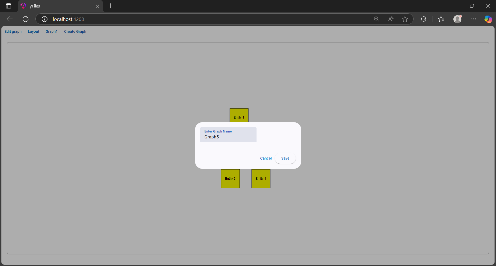
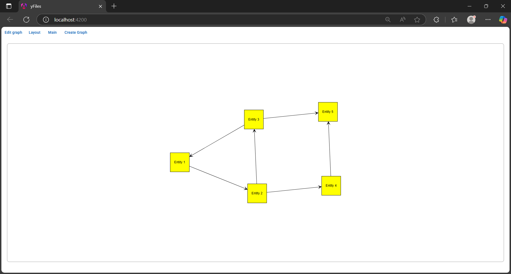

# 🧠 Graph Editor

A full-stack **Graph Editor** application that enables users to create, visualize, and manage graph structures through an interactive UI. Built with a robust modern stack and powered by `yFiles` for graph layout and visualization.

⚠️ **Important**: This project uses [yFiles](https://www.yworks.com/products/yfiles), which is a **commercial library**. A **valid paid license** is required to run the application. Without a license, the graph-related functionalities will not be available or will be limited to trial/demo capabilities.

## 🚀 Tech Stack

- **Backend**: [.NET Core Web API](https://dotnet.microsoft.com/)
- **Frontend**: [Angular](https://angular.io/)
- **Graph Library**: [yFiles](https://www.yworks.com/products/yfiles)
- **Database**: [MongoDB](https://www.mongodb.com/)

---

## ✨ Features

### Home page
A graph named "Main" will be loaded in the home page by default.


### 📋 Graph Menu

Select a graph from the menu to load it. 


 
The name of the selected graph is updated in the top accordingly. 


---

### 🧱 Create Graph

Click the "Create Graph" button and create a new graph from scratch, ready to customize with nodes and edges.





---

### ➕ Add Node

Click the "Edit graph" button and add new nodes with custom labels and relationships (parent/child selection).


---

### ❌ Delete Node

Select the node you want to delete and press the delete key. Click the delete button to confirm deletion. 


---

### 🧭 Apply Layout

Automatically organize your graph by clicking the layout button, using smart layout algorithms via yFiles.




---

## 📦 Installation & Setup

### 1. Backend Setup (.NET Core)

```bash
cd API
dotnet restore
dotnet run
```
### 2. Frontend Setup (.NET Core)
```bash
cd Client
npm install
ng serve
```
### 3. MongoDB setup
Ensure MongoDB is running. Update the MongoDB connection URI in your backend configuration file as needed (e.g., appsettings.json).
